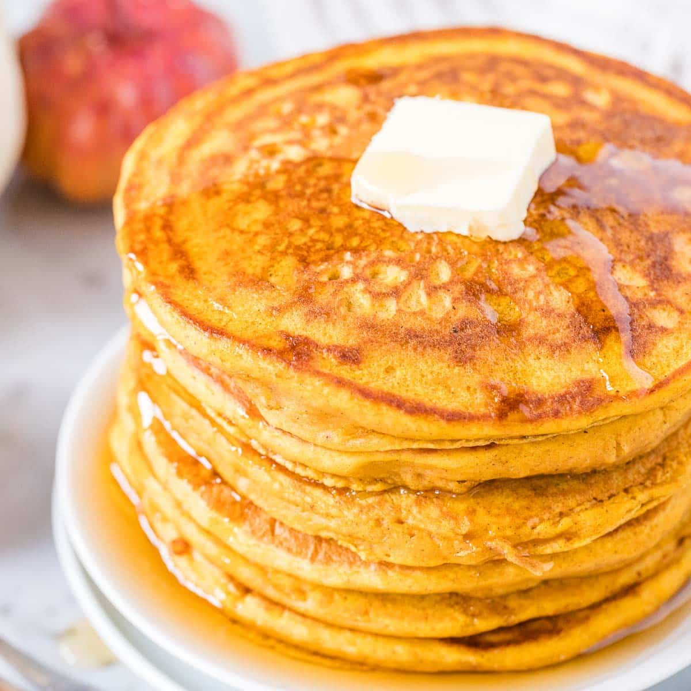

# Pumpkin Pancakes!!
## Recipe provided by [Allrecipes Pumpkin Pancake Recipe](https://www.allrecipes.com/recipe/17036/pumpkin-pancakes/)

**Ingredients**
- 1 1/2 cups milk
- 1 cup pumpkin puree
- 1 large egg
- 2 tablespoons vegetable oil
- 2 tablespoons vinegar
- 2 cups all-purpose flour
- 3 tablespoons brown sugar
- 2 teaspoons baking powder
- 1 teaspoon baking soda
- 1 teaspoon allspice
- 1 teaspoon ground cinnamon
- 1/2 teaspoon salt
- cooking spray

**Directions**
1. Gather all ingredients
2. stir milk, pumpkin, egg, oil, and vinegar together in a large bowl until well combined
3. Whisk flour, brown sugar, baking powder, baking soda, allspice, cinnamon, ginger, and salt together in a separate bowl. Add to pumpkin mixture; whisk just until combined
4. Spray a griddle or frying pan with cooking spray; heat over medium-high heat
5. Pour 3 to 4 tablespoons batter for each pancake onto the hot griddle and flatten batter slightly with a spoon
6. Cook until small bubbles appear, about 2 minutes
7. Flip and cook until golden brown, about 2 more minutes. Repeat with remaining batter
8. Serve hot and enjoy!
